- [一些图片](#一些图片)
- [一些文件](#一些文件)
- [焊盘&丝印](#焊盘丝印)
- [pcb 接线图](#pcb-接线图)
- [零件排线长度](#零件排线长度)
- [制作步骤（参考）](#制作步骤参考)
- [注意事项](#注意事项)
- [end](#end)

## 一些图片

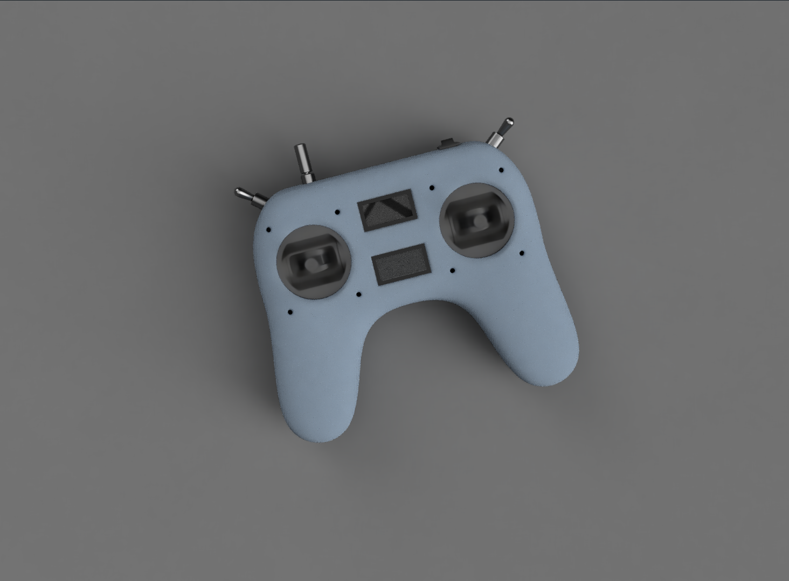

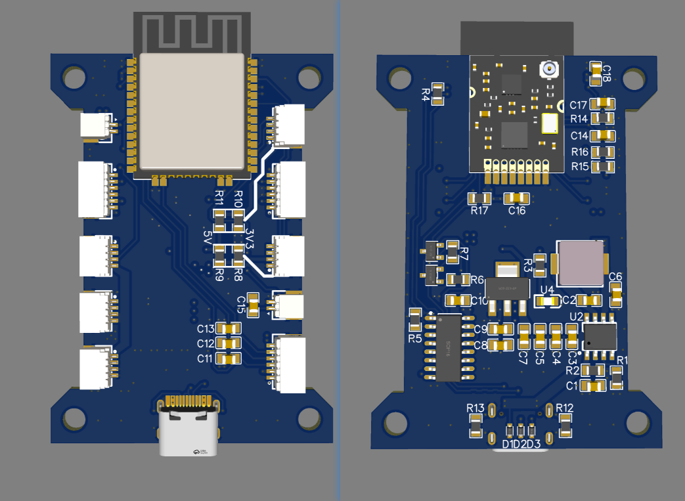

## 一些文件

- [购物清单](../pcb/esp_trans_v2_material.xlsx)  
- [3d模型-上半身](../3d%20model/top2.stl)，[3d模型-下半身](../3d%20model/bot2.stl)
- [立创eda 原理图](../pcb/LCEDA_schematic_esp_trans_v2.json)，[pdf 原理图](../pcb/pdf_schematic_esp_trans_v2.pdf)
- [立创eda pcb 源文件](../pcb/LCEDA_PCB_esp_trans_v2.json)，[gerber文件](../pcb/Gerber_PCB_esp_trans_v2.zip)  
- [bom表](../pcb/esp_trans_v2_bom_lite.xlsx)  

## 焊盘&丝印
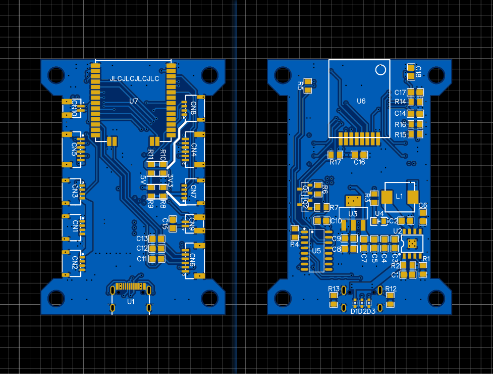
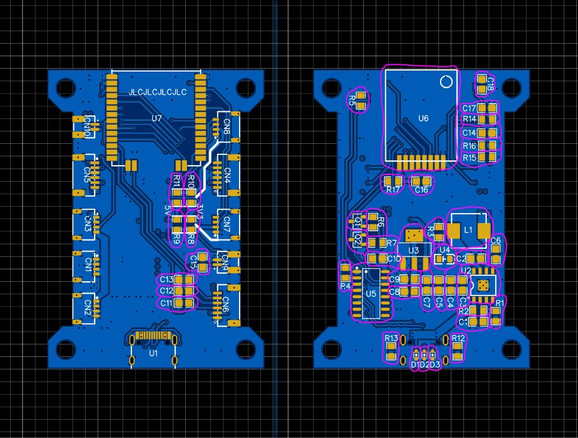

## pcb 接线图

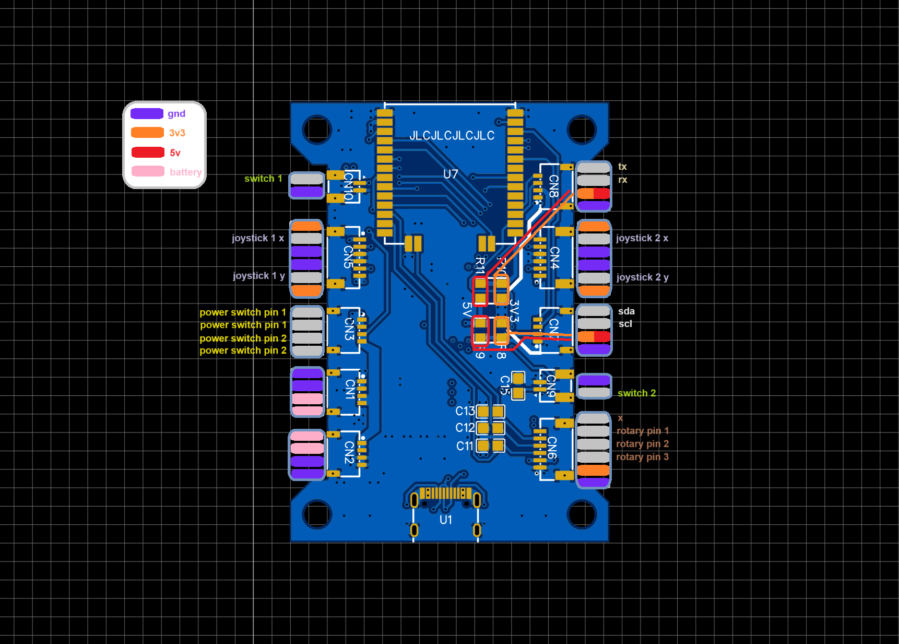  
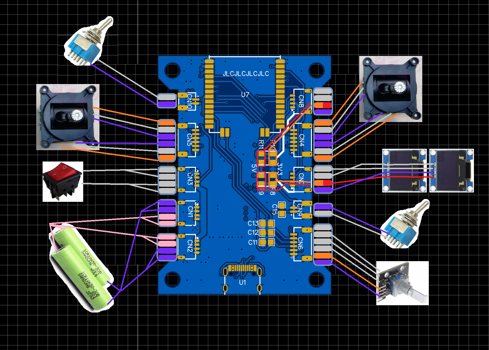  

## 零件排线长度
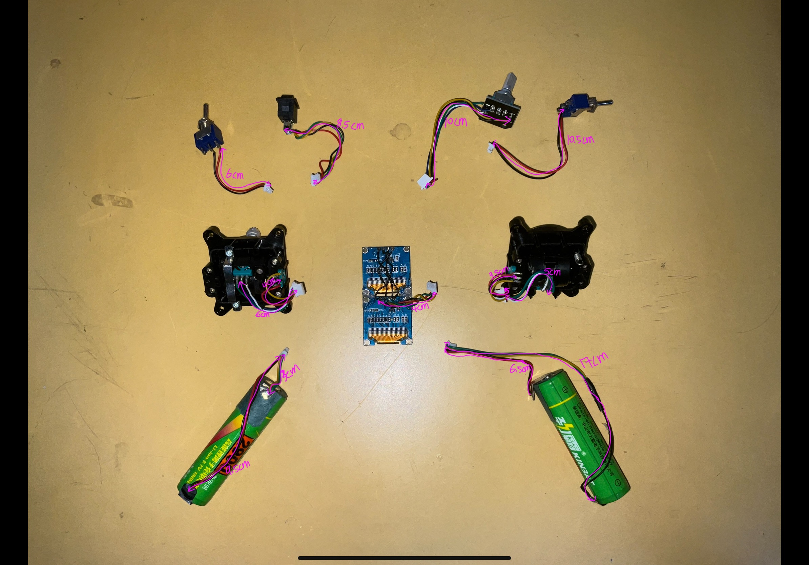  

## 制作步骤（参考）

1. 参考[购物清单](../pcb/esp_trans_v2_material.xlsx)购买材料。

2. 去[嘉立创](https://www.jlc.com/portal/)下单pcb。（[gerber文件](../pcb/Gerber_PCB_esp_trans_v2.zip)）

3. 按照 [bom表](../pcb/esp_trans_v2_bom_lite.xlsx)   焊接pcb。

4. 光固化打印外壳。[3d模型-上半身](../3d%20model/top2.stl)，[3d模型-下半身](../3d%20model/bot2.stl)。

5. 参考[pcb 接线图](#pcb-接线图)组装遥控。

## 注意事项
- 你需要取下屏幕模块上的针脚。（如有）  
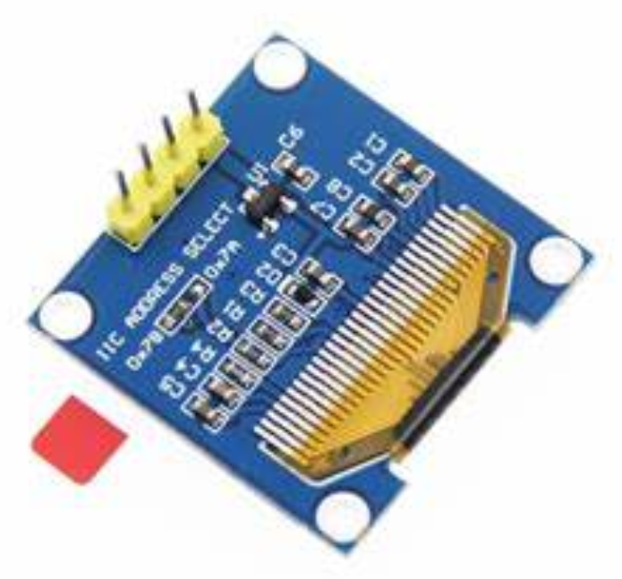  

- 采用 iic 通信的设备使用地址来区分彼此。因为esp32遥控有两块屏幕，所以你需要改变模块背面电阻的位置来改变iic地址。  
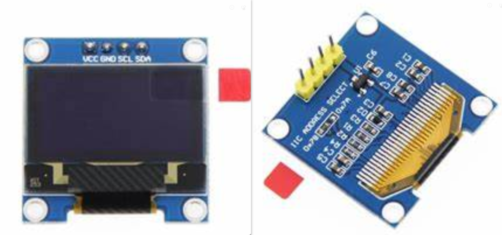  

- 需要对旋转编码器模块的pcb进行裁剪。你可用美工刀刮出一条浅缝，然后双手持钳子将pcb掰断。  
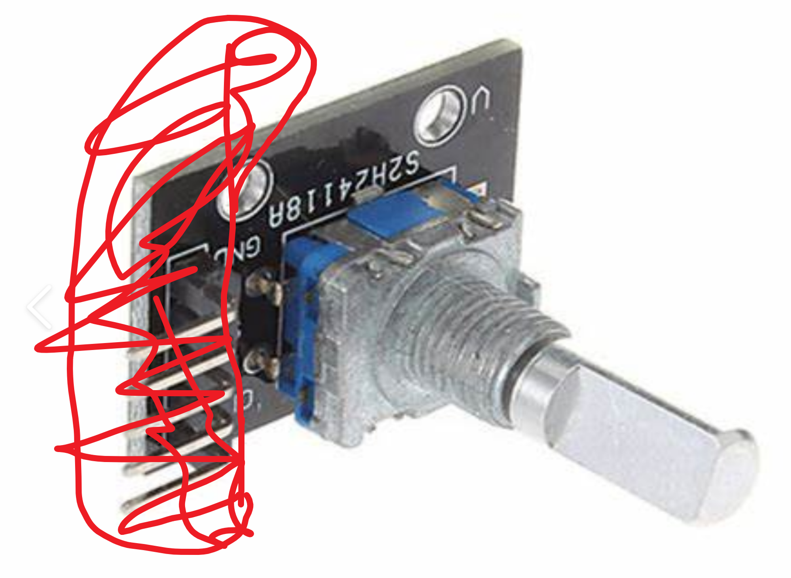  

- 最好选自带保护板的18650电池。  
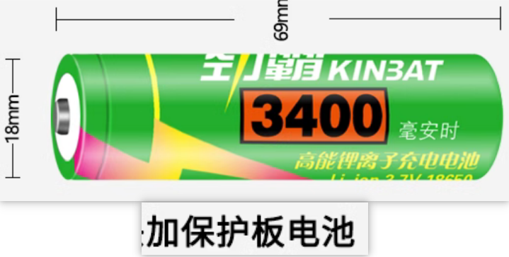  

- 需要将电池正负极引出来。（可以问下店家能不能帮下）  
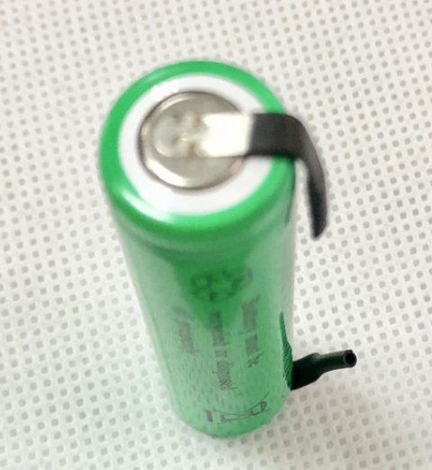  

## end
希望这个文档对大家有帮助。