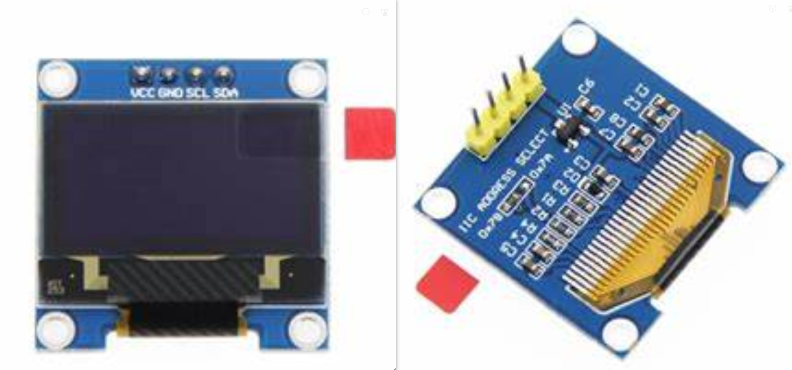

- [介绍](#介绍)
- [我需要知道什么](#我需要知道什么)
- [vscode配置](#vscode配置)
- [如何去理解代码](#如何去理解代码)
- [遥控的主要组成](#遥控的主要组成)
  - [0.96 inch oled屏幕](#096-inch-oled屏幕)
  - [航模摇杆](#航模摇杆)
  - [旋转编码器](#旋转编码器)
  - [拨动开关](#拨动开关)
  - [nrf24l01模块](#nrf24l01模块)
  - [菜单和菜单导航](#菜单和菜单导航)
- [源文件里都是什么](#源文件里都是什么)
- [固件烧录](#固件烧录)
- [end](#end)


## 介绍

- 使用 arduino 框架，基于 esp32-wroom-32u 的航模遥控。
- 本文档只提供手把半只手教学，不是保姆级教学哈。
- 在阅读本文档之前，大家可以看下这个关于遥控器的[视频](https://www.bilibili.com/video/BV1F94y157EU/?spm_id_from=333.999.0.0)。  
- 硬件文档在[这里](hardware_tut.md)。  


***
***
***


## 我需要知道什么

在阅读本教程之前最好懂得以下的一些知识。  
- c语言基础（一点点指针）
- 一点点cpp面向对象（不需要继承）
- arduino 基础（点灯，输入，输出）
- 听说过 iic，spi，gpio


***
***
***


## vscode配置

1. vscode 安装 arduino，C/C++，C/C++ Extension Pack 等插件，然后配置编译器。图片步骤在[这里](./img_soft_md/esp_trans_vscode.pdf)

2. 去 arduino board manager (ctrl + shift + p) 搜索并安装 esp32 包。***版本是 2.0.13 ！***。

3. 解压 src/z lib.zip，将里面的库复制到编译器的库文件夹。（在我的电脑里是 C:/Users/user1/Documents/Arduino/libraries/，没有这个文件夹就创建一个）  

4. 打开 src/src.ino。点击右上角的 verify 将自动在./vscode/ 生成 c_cpp_properties.json。 成功的话，你会发现各种报错都消失了。  

5. vscode配置完成！  


***
***
***


## 如何去理解代码

使用 arduino 框架设计一个产品非常的简单，通常情况下我们只要从网上找到产品里各个模块的库，然后像搭积木一样搭起来就可以了。  

接下来我将介绍如何使用esp32遥控的各个模块，相信到最后你可以很快的看懂esp32遥控的全部代码。


***
***
***


## 遥控的主要组成

1. [0.96 inch oled 屏幕模块](#096-inch-oled屏幕)
2. [航模摇杆](#航模摇杆)
3. [旋转编码器](#旋转编码器)
4. [拨动开关](#拨动开关)
5. [nrf24l01模块](#nrf24l01模块)
6. [菜单和菜单导航](#菜单和菜单导航)

***

### 0.96 inch oled屏幕

库的官方例子：[嗨](https://github.com/adafruit/Adafruit_SSD1306/blob/master/examples/ssd1306_128x64_i2c/ssd1306_128x64_i2c.ino)  
连接方式：iic  
注意：采用 iic 通信的设备使用地址来区分彼此。因为esp32遥控有两块屏幕，所以你需要改变模块背面电阻的位置来改变iic地址。  


在 arduino 下使用这款屏幕很简单。一般来说，我们通过变量名就能猜出其作用。我们一起来看下面的代码。
```cpp
#include <Wire.h>
#include <Adafruit_GFX.h>
#include <Adafruit_SSD1306.h>

#define SCREEN_WIDTH 128 // OLED display width, in pixels
#define SCREEN_HEIGHT 64 // OLED display height, in pixels
#define OLED_RESET     -1 // Reset pin # (or -1 if sharing Arduino reset pin)
#define SCREEN_ADDRESS 0x3D
Adafruit_SSD1306 display(SCREEN_WIDTH, SCREEN_HEIGHT, &Wire, OLED_RESET);

void setup() {

    // SSD1306_SWITCHCAPVCC = generate display voltage from 3.3V internally
    display.begin(SSD1306_SWITCHCAPVCC, SCREEN_ADDRESS);

    display.clearDisplay(); // 清空画布，但此时你的屏幕并不会清空，因为还没有“更新”。  
    display.setTextSize(2); // 设置字体大小。  
    display.setCursor(1, 15); // 设置光标的起点坐标。  
    display.println(F("hello world")); // 将 hello world 印在画布上。字母 h 大概在位置（1，15）附近。
    display.display(); // 将画布输出到屏幕，此时你可以看到 hello world 了。
}
```

***

### 航模摇杆

连接方式：模拟输入  
  

读取摇杆的位置，其实就是读取电位器的电压。我们只需要使用下面的一行代码即可获取数值。
```cpp
value = analogRead(pin); // esp32 的ADC是12位的，所以 analogRead(pin) 的范围是0-4095。
```

由于ADC的输出带有噪声，我们可以给ADC的数值添加一个一阶低通滤波器。（代码中 0.8 和 0.2 是滤波的参数，可以看下[这篇博客](https://www.cnblogs.com/embInn/p/14038131.html)）
```cpp
// 假设下面的代码每隔 x 毫秒运行一次。
cur_val = analogRead(pin); // cur_val - current value
lpf_val = (float)cur_val * 0.8 + (float)pre_val * 0.2; // lpf_val - low pass filter value。
pre_val = lpf_val; // pre_val - previous value
```

如果电位器的位置有偏移，我们可以用以下代码来修正。（如果你不知道[map()](https://www.arduino.cc/reference/en/language/functions/math/map/)是什么，可以[看这里](https://www.arduino.cc/reference/en/language/functions/math/map/) ）
```cpp
// cali_min_val - 摇杆在最低位的数值
// cali_mid_val - 摇杆在中间的数值
// cali_max_val - 摇杆在最高位的数值
if(lpf_val >= cali_mid_val) return map(lpf_val, cali_mid_val, cali_max_val, 4095/2, 4095);
else return map(lpf_val, cali_min_val, cali_mid_val, 0, 4095/2);
```

如何使用 joystick.h 和 joystick.cpp。
```cpp
// 各种定义可以在 joystick.h 和 joystick.cpp 中找到！！

JOYSTICK_AXIS j_rx;
JOYSTICK_AXIS j_ry;
JOYSTICK_AXIS j_lx;
JOYSTICK_AXIS j_ly;
JOYSTICK joysticks;

void setup()
{
    j_rx.init(pin_joystick1X, invert_joystick1X);
    j_ry.init(pin_joystick1Y, invert_joystick1Y);
    j_lx.init(pin_joystick2X, invert_joystick2X);
    j_ly.init(pin_joystick2Y, invert_joystick2Y);
    joysticks.init(&j_rx, &j_ry, &j_lx, &j_ly);

    Serial.println("calibrate_mid");
    joysticks.calibrate_mid();
    delay(500);
    Serial.println("calibrate_min_max");
    joysticks.calibrate_min_max();
    Serial.println("done");
    delay(500);
}

void loop()
{
    joysticks.update();
    Serial.println(joysticks.get_lx());
    Serial.println(joysticks.get_ly());
    Serial.println(joysticks.get_rx());
    Serial.println(joysticks.get_ry());
    delay(20);
}
```


***

### 旋转编码器

库的官方例子：[嗨](https://github.com/igorantolic/ai-esp32-rotary-encoder/tree/master/examples)  
连接方式：gpio  
   

一个可以旋转和按压的原件，我们转动它来滚动菜单，按压选择菜单。
```cpp
#include <AiEsp32RotaryEncoder.h>
#define pin_rotary_vcc -1
#define rotary_steps 8 // 类似鼠标的灵敏度
AiEsp32RotaryEncoder rotaryEncoder = AiEsp32RotaryEncoder(pin_rotary_a, pin_rotary_b, pin_rotary_button, pin_rotary_vcc, rotary_steps);
void IRAM_ATTR readEncoderISR() { rotaryEncoder.readEncoder_ISR(); } // 设置中断函数。当转动编码器的时候触发中断并更新数值。

void setup()
{
    rotaryEncoder.begin(); // 初始化
    rotaryEncoder.setup(readEncoderISR); // 开启中断
    rotaryEncoder.disableAcceleration(); // 关闭加速度。（设置鼠标和光标的移动距离为线性）
    rotaryEncoder.setBoundaries(0, 0, true); // 设置边界和是否转圈
    rotaryEncoder.reset(); // 重设当前的记录为0
}


void loop()
{
    Serial.println(encoder->readEncoder());
    if (encoder->isEncoderButtonClicked())
    {
        Serial.println("pressed");
    }

    delay(50);
}

```

***

### 拨动开关

连接方式：gpio  
   

普通的开关。
```cpp
digitalRead(pin_switch1)
```

***

### nrf24l01模块

库的官方例子：[嗨](https://github.com/nRF24/RF24/tree/master/examples)  
连接方式：SPI  
   

2.4g 无线收发模块。
```cpp
#define pin_nrf_ce 25
#define pin_nrf_csn 26

RF24 radio(pin_nrf_ce, pin_nrf_csn); // CE, CSN

void setup()
{
    radio.begin();
    radio.enableDynamicPayloads(); 
    radio.enableAckPayload(); //数据回传
    radio.setChannel(1); //设置通道
    radio.openReadingPipe(0, "12345678"); // 接收地址0-"12345678"
    radio.openReadingPipe(1, "82345671"); // 接收地址1-"82345671"
    radio.openWritingPipe("12345678"); // 发送地址-"12345678"
    radio.setPALevel(RF24_PA_MAX); // 设置发送功率。RF24_PA_MAX是一个enum。
    radio.stopListening(); // 停止接收（反过来说就是发送）
}

void loop()
{
    // mydata 可以是任何类型，但是数据的大小不能超过 32 byte。status 记录是否发送成功
    status = radio.write(&mydata, sizeof(mydata));
    
    // 如果发送成功且有数据回传
    if (status && radio.available()) radio.read(&mydata2, sizeof(mydata2));
}
```

***

### 菜单和菜单导航

我们用菜单导航去选择菜单，而一个菜单则会执行我们自定义的功能。从电脑的角度来看的话，这个由菜单和菜单导航组成的系统只有文件夹和可执行程序，没有文本文档。不过我们的菜单可以同时是一个文件夹和可执行程序。

   

我们先来了解菜单核心组件的规范。
```cpp
#define mymenu_max_subs 7 // 一个菜单最多可以有7个子菜单

class MYMENU // 菜单
{
    // 函数组 start-------------------------------------------------
    void showOnDisplay1(); // 选中此菜单时在屏幕1显示的画面。
    void showOnDisplay2(); // 当此菜单是选中的菜单的子菜单时在屏幕2显示的画面。
    void function_setup(); // 选中此菜单时运行一次 function_setup() 里的代码。
    void function_loop(); // 选中此菜单时周期性地运行 function_loop() 里的代码。
    void function_exit(); // 退出此菜单时运行一次 function_exit() 里的代码。
    // 函数组 end---------------------------------------------------
    
    MYMENU *parent_menu = NULL; // 此菜单的父级菜单
    MYMENU *submenu_list[mymenu_max_subs] = {NULL}; // 此菜单的子菜单  
};
```

我们设计不同的菜单是为了实现不同的功能，那我们怎么让不同的菜单有不同的函数组呢？使用类的继承好像可以，但在这里我们让每个 MYMENU 的实例去绑定一个自定义的功能函数。
```cpp
// 我们先设计一个功能函数。每个功能函数都有如下的固定格式。我们让 func_test_menu() 的5个case的功能和菜单函数组的功能一一对应。
void func_test_menu(int16_t n)
{
    switch (n)
    {
    case 1: // 选中此菜单时在屏幕1显示的画面。
        break;
    case 2: // 当此菜单是选中的菜单的子菜单时在屏幕2显示的画面。
        break;
    case 3: // 选中此菜单时运行一次 function_setup() 里的代码。
        break;
    case 4: // 选中此菜单时周期性地运行 function_loop() 里的代码。
        break;
    case 5: // 退出此菜单时运行一次 function_exit() 里的代码。
        break;
    }
}

// 现在我们只要把 func_test_menu() 和 菜单绑定即可。
MYMENU test_menu;
test_menu.init(&func_test_menu); // 绑定

// test_menu.showOnDisplay1() == func_test_menu(1)
// 具体的实现可以在 mymenu.h 和 mymenu.cpp 中找到。
```

接下来我们来看 菜单导航 是如何导航的。菜单导航 有两个参数就能开始工作了，一个是起始菜单，另外个是编码器。
```cpp
class NAVI
{
    MYMENU *current_menu = NULL; // 最新被选中的菜单。
    AiEsp32RotaryEncoder *encoder; // 旋转编码器
};
```

我们控制编码器的值的范围在 current_menu 的子菜单数量以内，这样我们就能通过旋转来选择子菜单，按压进入菜单。
```cpp
// .get_num_valid_submenus() - get number of valid submenus

encoder->setBoundaries(0, current_menu->get_num_valid_submenus() - 1, true); // 设置范围
if(/*button pressed*/) current_menu = current_menu->submenu_list[encoder->readEncoder()]；
```

你可能发现了我们这个 菜单导航 好像只能进不能出，因此我们还需要一个特殊的<退出>菜单来实现退出。
```cpp
MYMENU menu_exit;

encoder->setBoundaries(0, current_menu->get_num_valid_submenus() - 1, true); // 设置范围

if(/*button pressed*/)
{
    if(current_menu->submenu_list[encoder->readEncoder()] == menu_exit)
    {
        current_menu = current_menu->parent_menu；
    }else
    {
        current_menu = current_menu->submenu_list[encoder->readEncoder()]
    }
}
```

一些图片  
   
   

如何使用  mymenu.h 和 mymenu.cpp 创造一个多级菜单。
- mymenu_a
    - mymenu_b
      - mymenu_exit
    - mymenu_exit
```cpp
// 各种定义可以在 mymenu.h 和 mymenu.cpp 中找到！！

#include "mymenu.h"
#include <AiEsp32RotaryEncoder.h>


MYMENU mymenu_exit;
MYMENU mymenu_a;
MYMENU mymenu_b;


void func_menu_exit(int16_t){}
void func_menu_a(int16_t)
{
    switch (n)
    {
    case 1:
        // show something on display1 when current menu is menu_example
        break;
    case 2:
        // show something on display2 when menu_example is a submenu of current menu
        break;
    case 3:
        // do something once when menu_example is selected
        Serial.println("i am a!");
        break;
    case 4:
        // do something continuously when menu_example is selected
        break;
    case 5:
        // do something once when exit menu_example
        break;
    }
}


void func_menu_b(int16_t)
{
    switch (n)
    {
    case 1:
        // show something on display1 when current menu is menu_example
        break;
    case 2:
        // show something on display2 when menu_example is a submenu of current menu
        break;
    case 3:
        // do something once when menu_example is selected
        Serial.println("i am !b");
        break;
    case 4:
        // do something continuously when menu_example is selected
        break;
    case 5:
        // do something once when exit menu_example
        break;
    }
}


AiEsp32RotaryEncoder rotaryEncoder = AiEsp32RotaryEncoder(pin_rotary_a, pin_rotary_b, pin_rotary_button, pin_rotary_vcc, rotary_steps);
void IRAM_ATTR readEncoderISR() { rotaryEncoder.readEncoder_ISR(); }


NAVI menu_navi; // 菜单导航

void setup(){
    mymenu_exit.init(&func_menu_exit);

    mymenu_a.init(&func_menu_a);
    static MYMENU * alist_mymenu_a[] = {&mymenu_b, &mymenu_exit};
    mymenu_a.set_submenu(alist_mymenu_a, sizeof(alist_mymenu_a)/sizeof(MYMENU *));

    mymenu_b.init(&func_menu_b);
    static MYMENU * alist_mymenu_b[] = {&mymenu_exit};
    mymenu_b.set_submenu(alist_mymenu_b, sizeof(alist_mymenu_b)/sizeof(MYMENU *));

    rotaryEncoder.begin(); // 旋转编码器初始化
    rotaryEncoder.setup(readEncoderISR); // 旋转编码器初始中断
    rotaryEncoder.disableAcceleration(); // 关闭加速度。（如果你突然以很快的速度去移动鼠标，你会发现光标在屏幕上走了很长的距离）
    rotaryEncoder.setBoundaries(0, 0, 1); // 设置 记录变量 的边界和是否转圈。
    rotaryEncoder.reset(); // 重设当前记录变量的值为0

    menu_navi.init(&mymenu_a, &mymenu_exit, &rotaryEncoder);
}


void loop(){
    menu_navi.update();
}
```


***
***
***


## 源文件里都是什么

- {config.h} 一些配置例如管脚，电阻阻值，iic从机地址。  
- {joystick.h/cpp} 自定义的 摇杆 库。
- {mymenu_functions.h/cpp} 功能函数和普通函数的存放位置。
- {mymenu.h/cpp} 自定义的 菜单和菜单导航 库。
- {mynrf.h/cpp} 自定义的 nrf24l01 库。
- {src.ino} 调用各种库组成完整的程序。


***
***
***


## 固件烧录
如果代码验证成功但是烧录失败，你可能需要去操作几下遥控器的拨动开关和编码器。  

拨动开关和编码器使用了 esp32 中的一些特殊管脚，这些管脚控制着 esp32 的启动模式。当 esp32 通电时，你需要控制这些特殊管脚的电平来实现你想要的启动模式。  

关于esp32管脚的使用限制，大家可以去这个[网站](https://randomnerdtutorials.com/esp32-pinout-reference-gpios/)查看，这位作者总结了许多注意事项。


***
***
***


## end
希望这个文档对大家有帮助。


